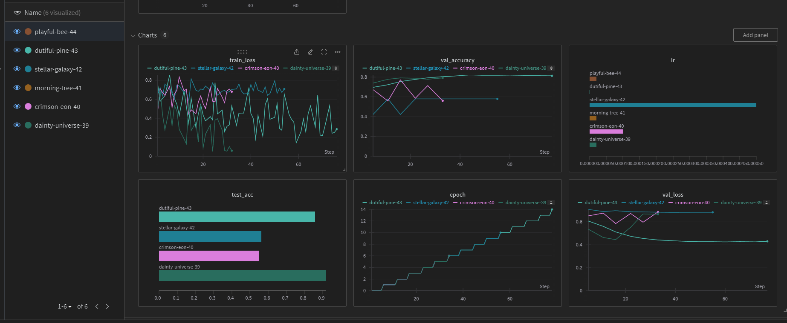

# Exam template for 02476 Machine Learning Operations

This is the report template for the exam. Please only remove the text formatted as with three dashes in front and behind
like:

```--- question 1 fill here ---```

where you instead should add your answers. Any other changes may have unwanted consequences when your report is auto
generated in the end of the course. For questions where you are asked to include images, start by adding the image to
the `figures` subfolder (please only use `.png`, `.jpg` or `.jpeg`) and then add the following code in your answer:

```markdown

```

In addition to this markdown file, we also provide the `report.py` script that provides two utility functions:

Running:

```bash
python report.py html
```

will generate an `.html` page of your report. After deadline for answering this template, we will autoscrape
everything in this `reports` folder and then use this utility to generate an `.html` page that will be your serve
as your final handin.

Running

```bash
python report.py check
```

will check your answers in this template against the constrains listed for each question e.g. is your answer too
short, too long, have you included an image when asked to.

For both functions to work it is important that you do not rename anything. The script have two dependencies that can
be installed with `pip install click markdown`.

## Overall project checklist

The checklist is *exhaustic* which means that it includes everything that you could possible do on the project in
relation the curricilum in this course. Therefore, we do not expect at all that you have checked of all boxes at the
end of the project.

### Week 1

* [X] Create a git repository
* [X] Make sure that all team members have write access to the github repository
* [X] Create a dedicated environment for you project to keep track of your packages
* [X] Create the initial file structure using cookiecutter
* [X] Fill out the `make_dataset.py` file such that it downloads whatever data you need and
* [X] Add a model file and a training script and get that running
* [X] Remember to fill out the `requirements.txt` file with whatever dependencies that you are using
* [X] Remember to comply with good coding practices (`pep8`) while doing the project
* [X] Do a bit of code typing and remember to document essential parts of your code
* [X] Setup version control for your data or part of your data
* [X] Construct one or multiple docker files for your code
* [X] Build the docker files locally and make sure they work as intended
* [X] Write one or multiple configurations files for your experiments
* [X] Used Hydra to load the configurations and manage your hyperparameters
* [X] When you have something that works somewhat, remember at some point to to some profiling and see if
      you can optimize your code
* [X] Use Weights & Biases to log training progress and other important metrics/artifacts in your code. Additionally,
      consider running a hyperparameter optimization sweep.
* [X] Use Pytorch-lightning (if applicable) to reduce the amount of boilerplate in your code

### Week 2

* [X] Write unit tests related to the data part of your code
* [X] Write unit tests related to model construction and or model training
* [X] Calculate the coverage.
* [X] Get some continuous integration running on the github repository
* [X] Create a data storage in GCP Bucket for you data and preferable link this with your data version control setup
* [X] Create a trigger workflow for automatically building your docker images
* [X] Get your model training in GCP using either the Engine or Vertex AI
* [X] Create a FastAPI application that can do inference using your model
* [ ] If applicable, consider deploying the model locally using torchserve
* [X] Deploy your model in GCP using either Functions or Run as the backend

### Week 3

* [ ] Check how robust your model is towards data drifting
* [ ] Setup monitoring for the system telemetry of your deployed model
* [ ] Setup monitoring for the performance of your deployed model
* [ ] If applicable, play around with distributed data loading
* [ ] If applicable, play around with distributed model training
* [ ] Play around with quantization, compilation and pruning for you trained models to increase inference speed

### Additional

* [ ] Revisit your initial project description. Did the project turn out as you wanted?
* [X] Make sure all group members have a understanding about all parts of the project
* [X] Uploaded all your code to github

## Group information

### Question 1
> **Enter the group number you signed up on <learn.inside.dtu.dk>**
>
> Answer:

6

### Question 2
> **Enter the study number for each member in the group**
>
> Example:
>
> *sXXXXXX, sXXXXXX, sXXXXXX*
>
> Answer:

s135313, s151988, s230284, s183558 


### Question 3
> **What framework did you choose to work with and did it help you complete the project?**
>
> Answer length: 100-200 words.
>
> Example:
> *We used the third-party framework ... in our project. We used functionality ... and functionality ... from the*
> *package to do ... and ... in our project*.
>
> Answer:

We used multiple third-party frameworks. To name a few:

- <b>wandb</b>: to track the training of the model, we used ``log_hyperparams()`` to log the configuration, ``watch()`` to log the gradients of the model and ``log_metrics()`` to log different metrics.
- <b>hydra</b>: to easier set up the configuration parameters and decouple the code from the configurations. The parameter sets are stored in ``*.yml`` files and accessed by ``train_main()`` as a dictionary using the hydra decorator. Furthermore, the hydra configurations were used for data processing.
- <b>Pytorch lightning</b>: to significantly reduced the amount of boilerplate code. As an example, after loading the parameters and instantiating a ``Trainer()`` object, the training amount to two lines: ``trainer.fit(<model>, <data>)`` and ``trainer.test(<model>, <data>)``
- <b>FastAPI</b>: a fast way to build an API (where we get simple web-based GUI for free) that in our case allows to enter sentences to make model predictions. The function to be executed is preceded  with a decorator serving as the interface to FastAPI. Additionally, there is a function which allows the user to update the model by fetching it from Google Bucket.


## Coding environment

> In the following section we are interested in learning more about you local development environment.

### Question 4

> **Explain how you managed dependencies in your project? Explain the process a new team member would have to go**
> **through to get an exact copy of your environment.**
>
> Answer length: 100-200 words
>
> Example:
> *We used ... for managing our dependencies. The list of dependencies was auto-generated using ... . To get a*
> *complete copy of our development environment, one would have to run the following commands*
>
> Answer:

We set up virtual environments using Anaconda/Mamba and installed dependencies from requirements.txt using Make file command ``make requirements``. We manually kept track of the requirements.txt file.

To get a complete copy of the environment required for developing, one could run "make requirements" inside any virtual environment after cloning the project. Here is an example based on conda but any other environment manager can be used:

- ``git clone git@github.com:s183558/MLOps6_Project.git .``: to clone our GitHub project.

- ``make create_environment``: to create a conda environment with a suitable python version.

- ``conda activate src``: to activate the created conda environment (called in this case ``src``).

- ``make dev_requirements``: to install all the dependencies (also the development dependencies) to be able to run the code.

If working locally one needs to set up and authenticate GCloud CLI.
Our Docker container setup currently depends on 2 API keys in root to authenticate with GCloud and WandB from inside the Docker container.


### Question 5

> **We expect that you initialized your project using the cookiecutter template. Explain the overall structure of your**
> **code. Did you fill out every folder or only a subset?**
>
> Answer length: 100-200 words
>
> Example:
> *From the cookiecutter template we have filled out the ... , ... and ... folder. We have removed the ... folder*
> *because we did not use any ... in our project. We have added an ... folder that contains ... for running our*
> *experiments.*
> Answer:

After creating the environment and installing the dependencies the project was indeed initialized using the provided Cookiecutter template from the [course](https://github.com/SkafteNicki/mlops_template). 

.  
├── data/  
├── dockerfiles/  
├── docs/  
├── Makefile  
├── models/  
├── pyproject.toml  
├── README.md  
├── reports/  
├── requirements_dev.txt  
├── requirements.txt  
├── src/  
└── tests/  

The structure above was the starting point of our project, being the most relevant folders the following:  

-  <b>``data/``</b>: contains the .dvc pointers to the google storage to access the data.  
-  <b>``models/``</b>:  contains the generated trained models (bookkept by Pytorch Lightning).  
-  <b>``src/``</b>:  contains the source code of the project.  
-  <b>``tests/``</b>:  contains the unit tests for the project.  

In addition to the structure provided by Cookiecutter we added the following folders:  
-  <b>``app/``</b>: contains the FastAPI.   
-  <b>``conf/``</b>: contains the configuration.  


### Question 6

> **Did you implement any rules for code quality and format? Additionally, explain with your own words why these**
> **concepts matters in larger projects.**
>
> Answer length: 50-100 words.
>
> Answer:

We didn't implement any rules for code quality, although we installed ``ruff``, helping to comply with PEP8 guidelines. We attempted to do type hinting in most of our code, but in general we didn't use any 3rd. party code quality checkers as the code quality in the team was reasonably good. However, for larger projects it's recommended to enforce some code quality rules. In practice it's not that important which set of rules are enforced (as long as they are reasonable). A set of rules ensures consistency, and it's easier for the members to understand each others code.


## Version control

> In the following section we are interested in how version control was used in your project during development to
> corporate and increase the quality of your code.

### Question 7

> **How many tests did you implement and what are they testing in your code?**
>
> Answer length: 50-100 words.
>
> Example:
> *In total we have implemented X tests. Primarily we are testing ... and ... as these the most critical parts of our*
> *application but also ... .*
>
> Answer:

In total we implemented four ``test_*.py`` files being the central parts of the code to test: 

<b>Data processing</b>: Before training we want to ensure that the correct data/input is available.  
<b>Training logic</b>: We considered that the most important part to test was the training logic. Therefore, two types of tests where made. One with a subset of the real training data and an additional test to verify whether the functions in the training loop are called appropriately.  
<b>Prediction logic</b>: Simple test that verifies that the return data size and type are correct.  


### Question 8

> **What is the total code coverage (in percentage) of your code? If you code had an code coverage of 100% (or close**
> **to), would you still trust it to be error free? Explain you reasoning.**
>
> Answer length: 100-200 words.
>
> Example:
> *The total code coverage of code is X%, which includes all our source code. We are far from 100% coverage of our **
> *code and even if we were then...*
>
> Answer:

According to the coverage report 87% of the code was covered/tested. The following files were not covered 100%:  

<code>
src/data/dataset.py:      94%   
src/data/make_dataset.py: 91%   
src/predict_model.py:     52%   
src/train_model.py:       78%   
</code>

We could have made more test to come closer to 100% but at least we have now the proper workflow set up correctly. It is worth to mention that 100% coverage does not guarantee error-free code for various reasons:  
1) The testing code could be wrong.  
2) The test may inadvertently rely on that all resources  are available (e.g. files to be loaded). If the tested code does not implement the necessary error handling, then no error is caught until the code is deployed in production.  
3) The tests above are ``unit test`` which tests the functions isolated from the world. Integration tests are also necessary to ensure that the interfaces between the functions and modules work as intended.

### Question 9

> **Did you workflow include using branches and pull requests? If yes, explain how. If not, explain how branches and**
> **pull request can help improve version control.**
>
> Answer length: 100-200 words.
>
> Example:
> *We made use of both branches and PRs in our project. In our group, each member had an branch that they worked on in*
> *addition to the main branch. To merge code we ...*
>
> Answer:

We agreed in the group at the beginning of the project to consider the 'main' branch as the production branch so it should in theory always be able to run without errors. Therefore, we strived to do most of the work in "features" branches. Once we could verify the python tests passed locally, the branch was pushed to the remote repo. Afterwards, depending on the number of changes, either a group peer reviewed the code in cooperation with the author, or the author simply merged the branch into the main branch and then verified the main branch worked as intended. 


### Question 10

> **Did you use DVC for managing data in your project? If yes, then how did it improve your project to have version**
> **control of your data. If no, explain a case where it would be beneficial to have version control of your data.**
>
> Answer length: 100-200 words.
>
> Example:
> *We did make use of DVC in the following way: ... . In the end it helped us in ... for controlling ... part of our*
> *pipeline*
>
> Answer:

Initially, we used DVC to manage the raw training data (not the processed data) and the trained models. It helped us in a practical way allowing us to separate the code (versioned with git in a GitHub repo, which only allows versioning relatively small files) from the data (versioned with DVC in the Google Storage). However, if the model was deployed in a production environment, then with time the model would need to be retrained with an updated dataset. In that case it would allow us to harness the full potential of data/model versioning where we could examine the performance of different models with different datasets.

Due to authentication issues, we stopped using DVC and loaded the data directly from the Google Cloud storage bucket. While not as streamlined as DVC it’s possible to restore previous file versions. It would be preferable to use DVC in cases, where we would want to use several different versions of datasets/models. 


### Question 11

> **Discuss you continues integration setup. What kind of CI are you running (unittesting, linting, etc.)? Do you test**
> **multiple operating systems, python version etc. Do you make use of caching? Feel free to insert a link to one of**
> **your github actions workflow.**
>
> Answer length: 200-300 words.
>
> Example:
> *We have organized our CI into 3 separate files: one for doing ..., one for running ... testing and one for running*
> *... . In particular for our ..., we used ... .An example of a triggered workflow can be seen here: <weblink>*
>
> Answer:

We created a GitHub workflow [(.github/workflows/test_on_push.yml)](https://github.com/s183558/MLOps6_Project/blob/main/.github/workflows/test_on_push.yml) that is triggered when there is a push to the ``main`` branch and when a pull request is made to the ``main`` branch. We kept it fairly simple where only a runner is built (Ubuntu based) and only a python version is tested. We made use of cache to improve the speed of subsequent builds. The unit tests are tested again since any merge into main can risk breaking the build.

We decided to trigger the training in Google Cloud manually to avoid exceeding the free quota. However, in a more realistic scenario, we could have the ``main`` branch, as many features branches as necessary, a developer branch and a branch with the sole purpose to train the model. The isolation of the training activity in a branch would allow to better control the available quota and/or resources.

The test summary of this [job](https://github.com/s183558/MLOps6_Project/actions/runs/7504814581/job/20432714507#step:10:57) in GitHub illustrates the value of continuous integration:

<code>
=========================== short test summary info ============================  
ERROR tests/test_train_mock.py    
ERROR tests/test_train_real_data.py   
!!!!!!!!!!!!!!!!!!! Interrupted: 2 errors during collection !!!!!!!!!!!!!!!!!!!!   
============================== 2 errors in 3.22s ===============================  
Error: Process completed with exit code 2.  
</code>

When a pull request from a feature branch to the main branch was made, the ``test_on_push.yml`` workflow was triggered. The workflow acts as a safeguard, catching the error in the pull request before introducing the error in the main branch and then propagating the error to all the members.


## Running code and tracking experiments

> In the following section we are interested in learning more about the experimental setup for running your code and
> especially the reproducibility of your experiments.

### Question 12

> **How did you configure experiments? Did you make use of config files? Explain with coding examples of how you would**
> **run a experiment.**
>
> Answer length: 50-100 words.
>
> Example:
> *We used a simple argparser, that worked in the following way: python my_script.py --lr 1e-3 --batch_size 25*
>
> Answer:

The experiments were configured using Hydra as shown below:

<code>
@hydra.main(version_base=None, config_path="../conf", config_name="config.yaml")  
def train_main(cfg:DictConfig):
    
    [...]

    # Model
    learning_rate = cfg.model["lr"]
    epochs = cfg.model["epochs"]

    [...]
</code>
The decorator fetches the main configuration yaml file where the data and model configuration filenames were specified (e.g. default.yaml, many_epochs.yaml etc.)
It is an efficient way to deal with multiple experiments without having to modify the code. We also experimented with different hyperparameters running the training file as <code>python src/train_model.py model model.lr=1e-6 model.epochs=20</code> thus easily overriding the values specified in the .yaml, while still tracked in wandb. 


### Question 13

> **Reproducibility of experiments are important. Related to the last question, how did you secure that no information**
> **is lost when running experiments and that your experiments are reproducible?**
>
> Answer length: 100-200 words.
>
> Example:
> *We made use of config files. Whenever an experiment is run the following happens: ... . To reproduce an experiment*
> *one would have to do ...*
>
> Answer:

In order to reproduce the experiments, we made use of Hydra as described in the previous question as well as WandB. The workflow to run an experiment is the following:  

  1) The necessary dependencies were installed on the virtual machine from Gcloud, or locally if an experiment was done locally.  
  2) The default parameter values in the config file were set up.  
  3) An experiment with the default hyperparameters is run with ``python3 src/train_model.py``, or ``python3 src/train_model.py <hyperparameter_A>=x <hyperparameter_B>=y`` if some hyperparameters should be changed for expermiental sake.  
  4) The runs is being logged with WandB.   
  5) If the result of the test corresponded to a better model than previously achieved, we would manually go into WandB and download the checkpoint and place it in the "best_model" folder in our Gcloud bucket.


### Question 14

> **Upload 1 to 3 screenshots that show the experiments that you have done in W&B (or another experiment tracking**
> **service of your choice). This may include loss graphs, logged images, hyperparameter sweeps etc. You can take**
> **inspiration from [this figure](figures/wandb.png). Explain what metrics you are tracking and why they are**
> **important.**
>
> Answer length: 200-300 words + 1 to 3 screenshots.
>
> Example:
> *As seen in the first image when have tracked ... and ... which both inform us about ... in our experiments.*
> *As seen in the second image we are also tracking ... and ...*
>
> Answer:

In order to track the experiments and to visualize them we used the third-party tool called [Weights & Biases](https://wandb.ai/). The figure below shows the results of one experiment (where the model was trained with a set of parameters as specified in the configuration yaml file):


Each experiment gets an automatic generated name for easier recognition. In this case the experiment is called ``treasured_water-12``. The included plots display how four variables change along training, being: ``epoch``, ``train_loss``, ``val_accuracy`` and ``val_loss``.  

The ``epoch`` increases gradually as expected. ``val_accuracy`` gives an overall idea of how accurate the model to classify the tweets from the validation dataset (two labels are possible: 'catastrophe' and 'not catastrophe'). The most important variables in the plot are ``train_loss`` and ``val_loss``. Ideally we would like to see a gradual reduction/improvement of the ``train_loss`` and the same for ``val_loss``. In order to avoid overfitting, an early stop strategy was enabled. It is fair to say that based on the presented plot, the model does not seem to learn, although at the end the group managed to train a model which was somewhat able to classify the tweets. 

In the experiments below, we have run the same model, but with different learning rates. This then shows us that the configurations used in ``dainty-universe-39`` is the best model. The model was then downloaded and uploaded to the Gcloud bucket.




### Question 15

> **Docker is an important tool for creating containerized applications. Explain how you used docker in your**
> **experiments? Include how you would run your docker images and include a link to one of your docker files.**
>
> Answer length: 100-200 words.
>
> Example:
> *For our project we developed several images: one for training, inference and deployment. For example to run the*
> *training docker image: `docker run trainer:latest lr=1e-3 batch_size=64`. Link to docker file: <weblink>*
>
> Answer:

We containerized all relevant code for training and evaluating a model into a single Docker image. The image can be locally built such as:
<code>docker build -f Dockerfile . -t trainer:latest</code>
And the image can then be run as:
<code>docker run --name train_instance trainer:latest</code>

We created a second Docker image for deployment containng code for loading the trained model from the GCcloud storage bucket and performing predictions with it through deployment of the FastAPI application.

We have a ``dockerfiles/`` directory in the root containing the image for deployment (fastapi.dockerfile). 
The training-related dockerfile is located in the root named "Dockerfile". Preferably, this should be moved to the ``dockerfiles/`` directory. 

<b>Link to the training docker image:</b> (If the PC has limited RAM, it is recommeded to run it in interactive mode to verify at least the directory structure)  

https://drive.google.com/drive/folders/17tL9N1S-9G-9jolGqtUh1o7XgM2_OP7K?usp=sharing

Instruction to run the container:  
1) Download tar file using the link above.  
2) ``docker load -i <path to tar file>``  
3a) ``docker run -it --entrypoint sh --gpus all  gcr.io/mlops6-410910/testing:latest``  
3b) (``--gpu all`` only if on cuda-enabled system)   

Then it should start colleting data and training afterwards.  

<b>Note:</b> Since we didn't include the makefile in the dockerbuild, it can be tested by running:
``python src/train_model.py``


### Question 16

> **When running into bugs while trying to run your experiments, how did you perform debugging? Additionally, did you**
> **try to profile your code or do you think it is already perfect?**
>
> Answer length: 100-200 words.
>
> Example:
> *Debugging method was dependent on group member. Some just used ... and others used ... . We did a single profiling*
> *run of our main code at some point that showed ...*
>
> Answer:
We strived to implement proper logging in source code while writing it to easily identify where problems might occur. Most debugging was done using the VSCode built-in debugger. 

However, the codebase is relatively small compared to the complexity of the tools employed. Most of the code was written while the unit tests were designed. At that stage both the code being tested, and the testing code could fail and it would typically be sufficient to see the error messages returned by Python. The errors were fairly straight forward to spot. 

The majority of the errors encountered while running the experiments were due to issues with the necessary credentials so the different service could interact with each other. In the ideal case some unit tests and integration tests should have been designed to address those types of errors, but we found it to be more valuable to invest the time in the remaining of the MLOps workflow.


## Working in the cloud

> In the following section we would like to know more about your experience when developing in the cloud.

### Question 17

> **List all the GCP services that you made use of in your project and shortly explain what each service does?**
>
> Answer length: 50-200 words.
>
> Example:
> *We used the following two services: Engine and Bucket. Engine is used for... and Bucket is used for...*
>
> Answer:

- <b>Compute Engine</b>: It allows us to run a virtual machine in which we can e.g. run a Docker container to train the model.

- <b>Cloud Storage</b>:  A place in the cloud where we can access (read/write) large files. They can be the datasets for training and models for predictions.

- <b>Cloud build</b>: For building Docker images. Used with a Github push trigger to build training and deployment Docker files. 

- <b>Artifact Registry</b>: For storing and manage build artifacts. Stores Docker builds.

- <b>Secret Manager</b>: A service for handling sensitive data, such as API keys. Used for service account API key and WandB api key in Docker build.

- <b>Vertex AI</b>: A service which can be used for ML training and deployment. Only used briefly for CPU-training testing purposes.

- <b>Cloud Run</b>: It can be considered as a simpler version of Kubernetes for container orchestration.


### Question 18

> **The backbone of GCP is the Compute engine. Explained how you made use of this service and what type of VMs**
> **you used?**
>
> Answer length: 100-200 words.
>
> Example:
> *We used the compute engine to run our ... . We used instances with the following hardware: ... and we started the*
> *using a custom container: ...*
>
> Answer:

Initially we planned on using the Vertex AI API for training our models, but due to GPU quota increase issues we created a VM instance instead. The VM was located in an European zone (europe:west2-a) where Nvidia T4 GPU was available. For initial setup of the entire workflow, we used a spot provisioned VM for lowering costs. The machine type vas n1-standard-1 with 50 GB storage on the boot disk using the ``c0-deeplearning-common-gpu-v20231209-debian-11-py310`` image, which is a Debian distribution with preinstalled Nvidia drivers (CUDA). When we were ready to do longer training sessions, we created a similar VM only with standard provisioning and 100 GB storage on boot disk. 
On the VM we authenticated using ``gcloud init`` and assigned the default compute engine storage account, which has access to the artifact/container registry. Then we pulled the training Docker file onto the VM and ran it with the docker flag  ``--gpu all``.
During the Docker file build process, we downloaded the service account API key and wandb authentication API key into the Docker file, thus enabling us to load the raw training data for training and collecting both models, logs and metrics in wandb.

### Question 19

> **Insert 1-2 images of your GCP bucket, such that we can see what data you have stored in it.**
> **You can take inspiration from [this figure](figures/bucket.png).**
>
> Answer:


### Question 20

> **Upload one image of your GCP container registry, such that we can see the different images that you have stored.**
> **You can take inspiration from [this figure](figures/registry.png).**
>
> Answer:


### Question 21

> **Upload one image of your GCP cloud build history, so we can see the history of the images that have been build in**
> **your project. You can take inspiration from [this figure](figures/build.png).**
>
> Answer:


### Question 22

> **Did you manage to deploy your model, either in locally or cloud? If not, describe why. If yes, describe how and**
> **preferably how you invoke your deployed service?**
>
> Answer length: 100-200 words.
>
> Example:
> *For deployment we wrapped our model into application using ... . We first tried locally serving the model, which*
> *worked. Afterwards we deployed it in the cloud, using ... . To invoke the service an user would call*
> *`curl -X POST -F "file=@file.json"<weburl>`*
>
> Answer:

We deployed the model both locally and in the cloud. The branch ``upload_docker_to_gcloud`` in Github triggers the build of the application docker image which is stored in bucket of Google Cloud as an artifact. Afterwards it can e.g. be retrieved manually by executing in a local PC the following:  

``docker pull gcr.io/mlops6-410910/app:latest``

Once the image is pulled, the corresponding container can be created and run with:

``docker run --name our_fantastic_container -p 80:80 gcr.io/mlops6-410910/app:latest``


On success, the generated web GUI can be assessed as shown below:

<code>
INFO:     Started server process [1]  
INFO:     Waiting for application startup.  
INFO:     Application startup complete.  
INFO:     Uvicorn running on http://0.0.0.0:80 (Press CTRL+C to quit)  
</code>


In the dockerfile, the entry point of the container calls ``main_fastapi`` where the FastAPI logic is implemented. The two main functions available for the user through the web GUI are:

- <b>``@app.get("/predictions/")``</b>: where the user can enter Twitters and the model predicts whether it is a catastrophe or not.
- <b>``@app.get("/update_model/")``</b>: allows the user to update the model without having to pull a new image and create a new container.


### Question 23

> **Did you manage to implement monitoring of your deployed model? If yes, explain how it works. If not, explain how**
> **monitoring would help the longevity of your application.**
>
> Answer length: 100-200 words.
>
> Example:
> *We did not manage to implement monitoring. We would like to have monitoring implemented such that over time we could*
> *measure ... and ... that would inform us about this ... behaviour of our application.*
>
> Answer:

We sadly did not manage to implement monitoring. 
First and foremost, it would be nice to see how many people are actually using our application, to figure out the demand of the model, coming from a business point of view. But from a technical point of view, it would be nice to see if the hardware, which the application runs on, is actually holding up to the demand/traffic it receives. It would also be nice to see how fast the application actually serves the user, as we all nowadays have a short attention span, which means we don't wasn't to wait long for the answer provided by our application.

### Question 24

> **How many credits did you end up using during the project and what service was most expensive?**
>
> Answer length: 25-100 words.
>
> Example:
> *Group member 1 used ..., Group member 2 used ..., in total ... credits was spend during development. The service*
> *costing the most was ... due to ...*
>
> Answer:

We ended up using only roughly $4.0. Most of which was spend on Cloud Storage, and secondly running the VM. However, if we chose to attempt creating a well-performing model we would expect the GPU-training to increase cost considerably.

## Overall discussion of project

> In the following section we would like you to think about the general structure of your project.

### Question 25

> **Include a figure that describes the overall architecture of your system and what services that you make use of.**
> **You can take inspiration from [this figure](figures/overview.png). Additionally in your own words, explain the**
> **overall steps in figure.**
>
> Answer length: 200-400 words
>
> Example:
>
> *The starting point of the diagram is our local setup, where we integrated ... and ... and ... into our code.*
> *Whenever we commit code and puch to github, it auto triggers ... and ... . From there the diagram shows ...*
>
> Answer:


The diagram above shows gives an overview of the MLOps architecture we implemented in the project.  

The process starts in the <b><span style="color:blue;">development</span></b> phase, where the developer <b><span style="color:blue;">commits</span></b> code changes to the <b><span style="color:blue;">GitHub</span></b> repository. This action triggers <b><span style="color:blue;">GitHub Actions</span></b>, which are configured to run the <b><span style="color:blue;">unit tests</span></b>, going through various checks of the code. Parallel to that activity, the changes in the repository activate a <b><span style="color:blue;">Google Cloud Build Trigger</span></b>. This trigger is responsible for building a <b><span style="color:blue;">training docker</span></b> image with all the required dependencies and credentials/<b><span style="color:blue;">secrets</span></b>. The <b><span style="color:blue;">training docker</span></b> is designed for training the classification model. Furthermore, an <b><span style="color:blue;">application docker</span></b> image is also built, used to make predictions.  

In the <b><span style="color:blue;">Virtual Machine</span></b> running in  <b><span style="color:blue;">Google Cloud</span></b> the docker image is pulled and a container is created that trains the model with data retrieved from <b><span style="color:blue;">Google's bucket/data</span></b>. The <b><span style="color:blue;">training docker</span></b> is linked to a service running in <b><span style="color:blue;">W&S</span></b> which is in charge of logging information (such as metrics and hyperparameters) relevant for the performance analysis, comparison and tracking of the trained models. A model of choice is then saved in <b><span style="color:blue;">Google's bucket/models</span></b> which is in the deployment phase loaded by the <b><span style="color:blue;">application docker</span></b> container running in <b><span style="color:blue;">Cloud Run</span></b>. The entry point of <b><span style="color:blue;">application docker</span></b> is set to run the FastAPI and a web GUI can be accessed at the exposed <b><span style="color:blue;">URL://endpoint</span></b>. In there, Twitter messages can be entered, and the model predicts whether they can be considered as catastrophe or not.


### Question 26

> **Discuss the overall struggles of the project. Where did you spend most time and what did you do to overcome these**
> **challenges?**
>
> Answer length: 200-400 words.
>
> Example:
> *The biggest challenges in the project was using ... tool to do ... . The reason for this was ...*
>
> Answer:

After making sure that all group members had functional environments and OS-based dependencies installed properly, we began working on processing data, building a model and a training process. Due to parallelization of the workload, we ended up having overlap in code between our branches. Thus, we wasted a bit of time which may have been avoided if we settled earlier on what third party packages to use and to what extent. We ended up structuring data processing using Lightning PyTorch data module and training code in the Lightning trainer.  

It was time consuming and problematic moving from the local environment to Google Cloud, initially with granting the necessary credentials and permissions to allow the different tools to interchange data. More specifically it was the communication between 'wandb', 'dvc', docker containers and Github. We ended up discarding dvc and loading data directly from the Google Cloud bucket and saving trained models in wandb to select the best performing model and upload it back to the Cloud bucket models directory.

We initially wanted to use the Vertex AI API for GPU-enabled training but due to quota issues (still pending 5 days later) we used a VM instance instead. However, getting to create an appropriate GPU-enabled VM was non-trivial despite being a simple task. It took a lot of trial and error to find an available resource where the desired deep learning base image also worked. For some reason, the Nvidia driver installation failed on non-Europe zone machines while seemingly only few T4 GPU’s were available in the European zone. Further, it’s necessary to complete the instance creation before being notified if the requested machine is available or not. 
Figuring out how to best authenticate the docker container running in the VM to both access the Google Cloud bucket and wandb also was a bit time-consuming, especially when testing changes that required a new Docker build. We did end up with a good solution, that doesn’t expose any secret API keys.


### Question 27

> **State the individual contributions of each team member. This is required information from DTU, because we need to**
> **make sure all members contributed actively to the project**
>
> Answer length: 50-200 words.
>
> Example:
> *Student sXXXXXX was in charge of developing of setting up the initial cookie cutter project and developing of the*
> *docker containers for training our applications.*
> *Student sXXXXXX was in charge of training our models in the cloud and deploying them afterwards.*
> *All members contributed to code by...*
>
> Answer:

Student s135313 was in charge of data processing, training, implementing Hydra, managing GCloud, setup VM.  
Student s151988 was in charge of {the FastAPI for predictions and its containarization}.  
Student s230284 was in charge of {you are welcome to write the contributions}.  
Student s183558 was in charge of setting up WandB, creating unit tests, and DVC.  

Moreover all the members contributed with designing and creating the general workflow, create dockerfiles and writing the report.

